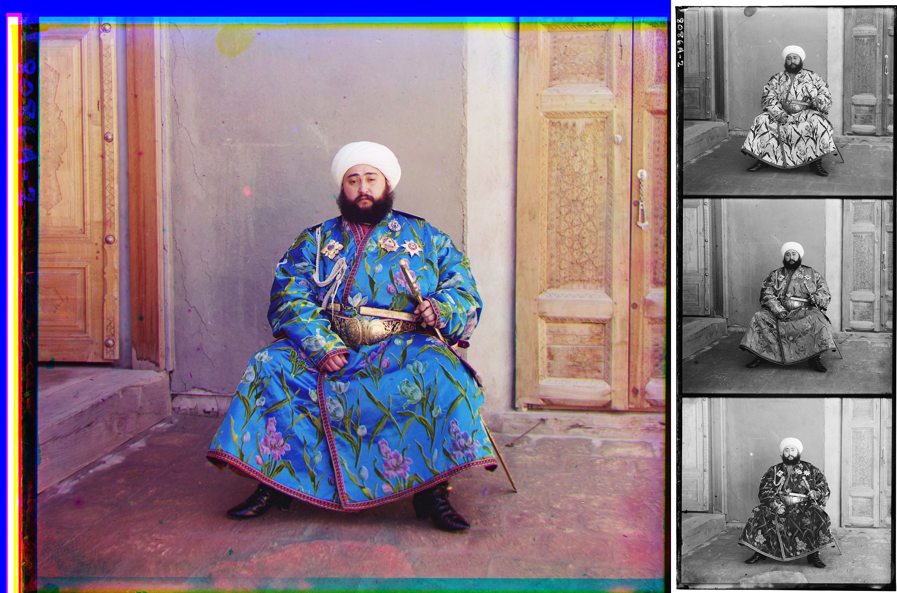
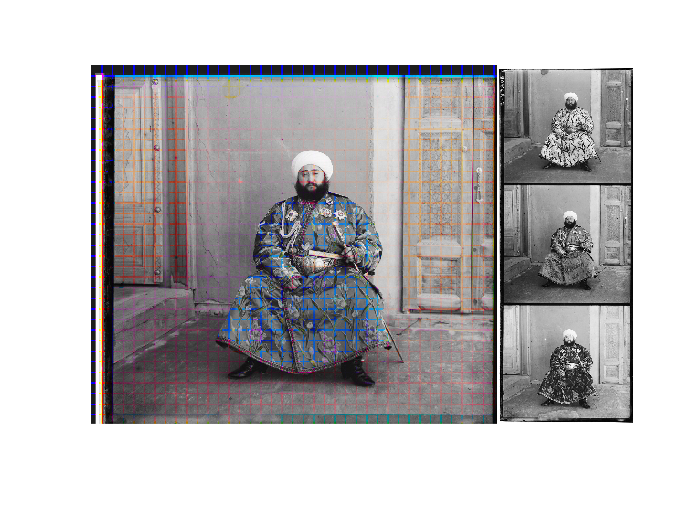

# cross_colour
Overlay saturated crosshatch grid onto grayscale image for illusory colours

Input:

Output:

To run: 

type 'cross_colour' into command window and select any .jpg image in the pop up window

after GIMP code published Jul 26 here:
https://www.patreon.com/posts/28661801

Tweet seen here:
https://twitter.com/page_eco/status/1155077311399489536?s=20

----
MATLAB Implementation:

-Opens image
-creates saturated version
-creates grayscale image
-loops through a grid and replaces the lines of the gray image with the saturated

Variables:

-Grid size
-Width
-Saturation increase in the code

